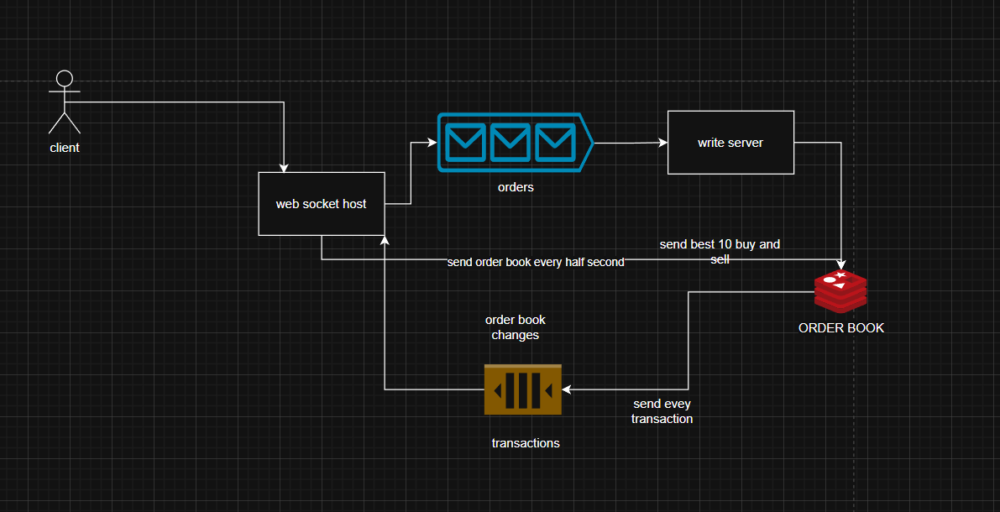

# Order Book System

This project implements a scalable and efficient Order Book system designed to handle real-time trading operations. Below is an overview of the architecture and components.

## System Overview

### Architecture



The system is composed of the following components:

1. **Client**
   - Users interact with the system to place orders or view market data.

2. **WebSocket Host**
   - Receives client orders via WebSocket.
   - Forwards validated orders to the Write Server.

3. **Write Server**
   - Processes and stores incoming orders.
   - Updates the **Order Book** with new buy/sell orders.

4. **Order Book** (Redis)
   - A high-performance database used to store and manage the order book.
   - Maintains the top 10 buy and sell orders, which are broadcasted periodically.

5. **Transactions**
   - Tracks executed transactions and order book changes.
   - Sends real-time transaction data to clients.

### Data Flow

1. **Order Placement:**
   - Clients submit orders via WebSocket Host.
   - Orders are validated and sent to the Write Server.

2. **Order Book Updates:**
   - The Write Server updates the Order Book stored in Redis.
   - OrderBook are sent to the clients every half-second.

3. **Transaction Updates:**
   - Every completed transaction is logged and broadcasted to clients.

## Features

- Real-time order processing.
- High-performance Redis-based order book.
- WebSocket-based client communication.
- Periodic broadcasting orderBook.
- Transaction tracking and notifications.

## Getting Started

### Prerequisites

- **docker:** Ensure docker is installed and running on your machine.

### Installation

1. Clone the repository:
   ```bash
   git clone https://github.com/hosmanoglu/orderbook.git
   ```

## Deployment

- The system can be deployed using Docker for containerized environments.
- Example Docker setup:
  ```bash
  docker-compose up
  ```

## Load test
- after  docker-compose up
    ```bash
    docker-compose run test_client npm run startStressTest
    ```

